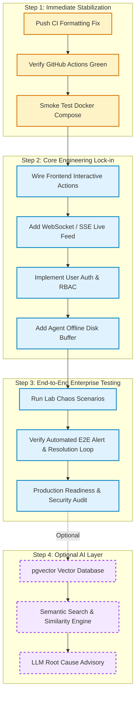

# AtlasTech — Project Status, Advancement Tracker & Engineering Roadmap

> **Core Engineering Philosophy:** *Core-First, AI-Last.*  
> AtlasTech is built to be a 100% functional, reliable, secure, and production-ready enterprise IT operations platform **without** requiring AI. The AI layer is strictly an optional late-stage add-on that will be layered on top only after every core engineering component (infra, backend, frontend, collector, docker, CI/CD, and security) is fully verified and locked down.

---

## 1. Executive Status Matrix

| Domain | Status | Completion | Test / Verification Evidence |
| :--- | :---: | :---: | :--- |
| **Backend & Engine** | 🟢 Solid Foundation | 85% | 14/14 Pytest passing (100%), SQLAlchemy 2.0 async, Alembic initial migration |
| **Frontend Dashboard** | 🟢 Functional UI | 80% | Next.js 15, Tailwind CSS v4, `tsc --noEmit` 0 errors |
| **Collector Agent** | 🟢 Working Prototype | 75% | Windows PowerShell collector, Scheduled Task installer, schema-compliant JSON |
| **Infrastructure & Lab** | 🟡 Provisioning Ready | 70% | Vagrantfile (DC + Client), AD automated setup & seeding, Chaos playbooks |
| **Docker & Local Dev** | 🟢 Complete Compose | 85% | Multi-service Compose (Postgres, Redis, API, Web) with health checks & Makefile |
| **GitHub & CI/CD** | 🟡 Action Required | 75% | Multi-job workflow configured; 2 Alembic import formatting fixes needed for green CI |
| **Security & Hardening** | 🟡 Baseline Established | 65% | API key authentication, DB connection pooling, Trivy scan; needs user login/RBAC |
| **AI / Intelligence Layer** | ⚪ Deferred (Optional) | 0% | Strictly held for final phase after core stability is locked |

---

## 2. What Is Already DONE (Verified & Operating)

### 2.1 Backend (`services/api`)
- **Framework & Models:** FastAPI with Python 3.11/3.13, SQLAlchemy 2.0 async ORM, and Pydantic v2 schemas.
  - Device asset registry (`DeviceModel` with UUID, hostname, IP, OS, status, metadata).
  - Telemetry record store (`TelemetryRecordModel` with CPU, memory, disk, network, services).
  - Incident management system (`IncidentModel` and `IncidentEventModel` tracking severity, status, root cause, timeline).
- **Automated Incident Threshold Engine:** Background rule engine evaluating ingested telemetry in real time:
  - Critical disk capacity breaches (>90%).
  - DNS resolution failures (flags local Active Directory / DC DNS outages).
  - Default gateway unreachable (network isolation detection).
  - Service down detection (AD DS, DNS Server, DHCP, Print Spooler).
- **REST API Endpoints (`/api/v1`):**
  - Devices: `GET /devices/`, `POST /devices/`, `GET /devices/{id}`, `PATCH /devices/{id}`.
  - Telemetry: `POST /telemetry/` (with automatic device registration and incident triggering), `GET /telemetry/latest/{hostname}`.
  - Incidents: `GET /incidents/` (filterable by status/severity), `POST /incidents/`, `GET /incidents/{id}`, `PATCH /incidents/{id}`.
  - Diagnostics: `GET /diagnostics/playbooks`, `POST /diagnostics/execute`.
  - Operations Summary: `GET /incidents/stats/summary` (real-time metric rollups).
- **Database & Migrations:**
  - PostgreSQL 16 schema with Alembic versioning (`alembic/versions/0001_initial_schema.py`).
  - Indexed foreign keys and cascade deletions.
- **Verification Suite:**
  - 14 integration and unit tests passing in `tests/` covering the full E2E loop.

### 2.2 Frontend Console (`apps/web`)
- **Technology Stack:** Next.js 15 (App Router), React 19, TypeScript, Tailwind CSS v4, Lucide icons.
- **Operations Console (`/`):**
  - Live KPI stats bar (Active Incidents, Critical Severity, Online Fleet count, MTTR indicator).
  - Fleet Asset Grid (displaying hostname, IP, OS, agent version, health badges, last seen timestamp).
  - Incident Triage Desk (incident cards with severity badges, affected hostname, rule triggered, duration timer, and action buttons).
  - Diagnostics Runner Drawer (UI to trigger and view remote troubleshooting playbooks).
- **Build Quality:** Strict TypeScript typing matching shared contracts; passes `tsc --noEmit` cleanly.

### 2.3 Endpoint Telemetry Agent (`agents/collector`)
- **PowerShell Vitals Collector (`collector.ps1`):**
  - Collects CPU utilization, RAM usage, storage volume stats, network interface details, DNS resolution status, and active system services.
  - Generates schema-compliant JSON payloads.
  - Transmits via HTTPS POST to the backend ingestion endpoint.
- **Service Deployment (`install.ps1`):**
  - Installs the collector script as a native Windows Scheduled Task running as `SYSTEM` with configurable execution intervals.

### 2.4 Infrastructure & Lab Simulation (`infra/`)
- **Automated Lab Topology (`infra/lab/Vagrantfile`):**
  - `dc01.atlastech.local`: Windows Server 2022 domain controller (AD DS, DNS, DHCP).
  - `client01.atlastech.local`: Windows 10/11 enterprise endpoint.
- **Domain Automation Scripts (`infra/lab/scripts/`):**
  - `install-ad.ps1`: Automated installation of Active Directory Domain Services.
  - `seed-ad.ps1`: Automated creation of organizational units (IT, Finance, HR), security groups, and sample enterprise user accounts.
  - `join-domain.ps1`: Domain join automation for endpoint clients.
- **Chaos Fault Injection Suite (`infra/chaos/`):**
  - `inject-dns-fault.ps1`: Simulates enterprise DNS outages to trigger threshold alerts.
  - `fill-disk.ps1`: Rapidly generates high disk consumption to validate capacity threshold detection.
  - `reset-chaos.ps1`: Restores normal operating state after chaos tests.

### 2.5 Docker & Local Developer Experience
- **Compose Architecture (`docker-compose.yml`):**
  - `postgres:16-alpine`: Database service with healthy `pg_isready` check.
  - `redis:7-alpine`: In-memory cache / message broker with password protection and health check.
  - `api`: Containerized FastAPI service with hot-reloading in development.
  - `web`: Containerized Next.js frontend with dynamic API URL resolution.
  - Bridge network (`atlastech`) and persistent volumes (`postgres_data`, `redis_data`).
- **Developer Makefile (`Makefile`):**
  - Targets for `make up`, `make down`, `make dev`, `make test`, `make lint`, `make typecheck`, `make build`, and `make clean`.

### 2.6 GitHub Governance & CI/CD
- **Workflows (`.github/workflows/ci.yml`):**
  - Multi-job CI running on every PR and push to `main`:
    - `api-lint`: Ruff check, format, and Mypy static typing.
    - `api-test`: Pytest with code coverage and live PostgreSQL service.
    - `web-lint`: ESLint and Next.js TypeScript typecheck.
    - `schemas-typecheck`: Shared TypeScript schema validation.
    - `security`: Trivy vulnerability scanner.
- **Commit Standards:**
  - Conventional Commits enforced via `.gitmessage` template and documented in [`.github/COMMIT_CONVENTION.md`](.github/COMMIT_CONVENTION.md).

---

## 3. What REMAINS To Be Done (Locking the Core Foundation)

Before any AI functionality is entertained, the following core engineering work must be executed and hardened:

### 3.1 Immediate Priority: CI / GitHub Health (P0)
- [ ] **Push Alembic Ruff Formatting Fix**: The GitHub Actions CI is currently reporting red because of import ordering in `alembic/env.py` and `alembic/versions/0001_initial_schema.py`. The files are reformatted locally; pushing this commit will turn the CI badge green.
- [ ] **Docker Compose End-to-End Build Verification**: Execute `docker compose up --build` locally to confirm container builds and inter-service networking operate flawlessly.

### 3.2 Backend & Engine Enhancements (P1)
- [ ] **WebSocket / Server-Sent Events (SSE) Live Feed**:
  - Replace frontend REST polling with a native WebSocket or SSE endpoint (`/api/v1/ws/telemetry` and `/api/v1/ws/incidents`) powered by Redis Pub/Sub.
  - Enable real-time screen updates the instant an agent reports or an incident fires.
- [ ] **Incident State Machine & Audit History**:
  - Formalize transitions: `OPEN` -> `ACKNOWLEDGED` -> `IN_PROGRESS` -> `RESOLVED` -> `CLOSED`.
  - Record audit log entries with technician identity, timestamp, and notes for every status update.
- [ ] **Ingestion Rate Limiting & DDOS Throttling**:
  - Protect `POST /api/v1/telemetry/` using Redis token-bucket rate limiting (e.g., maximum 10 requests/minute per device IP/API key).
- [ ] **Database Seeder CLI (`make seed`)**:
  - Create a Python script to populate the database with realistic sample devices, history, and active incidents for instant local demonstration.

### 3.3 Frontend Operations Console Polish (P1)
- [ ] **Interactive Incident Actions**:
  - Wire up the "Acknowledge", "Assign to Me", and "Resolve" buttons in the UI to call the backend PATCH endpoints.
  - Add resolution modal allowing technicians to input root cause notes and actions taken.
- [ ] **Live Telemetry Device Detail View**:
  - Dedicated device modal or page (`/devices/[id]`) showing real-time CPU/RAM/Disk metric graphs (using Recharts or Chart.js) and historical trend lines.
- [ ] **Filter & Search Controls**:
  - Full-text search and severity filter dropdowns for the incident table and fleet grid.

### 3.4 Telemetry Collector Hardening (P1)
- [ ] **Local Offline Spooling / Retry Buffer**:
  - When the collector cannot reach the API (network disconnect), queue heartbeat records to a local JSON file cache on disk and flush upon reconnection.
- [ ] **TLS Certificate Validation & API Key Security**:
  - Securely retrieve API keys from the Windows Credential Manager rather than plain-text command line parameters.
- [ ] **Multi-Platform Agent Mock (Linux/macOS)**:
  - Add a lightweight Python or shell collector script so developers without a Windows machine can generate authentic telemetry.

### 3.5 Infrastructure, Lab & Chaos Automation (P1/P2)
- [ ] **Vagrant Lab Automated Smoke Test**:
  - Document and verify the complete `vagrant up` lifecycle and domain provisioning.
- [ ] **Containerized Lab Alternative (Docker-based AD/DNS mock)**:
  - Provide a lightweight containerized mock (e.g. Samba AD or mock DNS server) for developers who do not have enough RAM to run two full Windows Server VMs in Vagrant.

### 3.6 Security & Enterprise Access Control (P1)
- [ ] **Authentication & User Accounts**:
  - Add JWT-based user login (`POST /api/v1/auth/login`) with bcrypt password hashing.
  - Role-Based Access Control (RBAC):
    - `Admin`: Full permissions (device decommissioning, user management, configuration).
    - `Technician`: Can view devices, run diagnostics, acknowledge and resolve incidents.
    - `Viewer`: Read-only dashboard access.
- [ ] **Reverse Proxy & TLS Termination**:
  - Add production Nginx or Caddy configuration with automated HTTPS certificates in front of the API and Web containers.

---

## 4. Phase 5: The AI Layer (Strictly Optional & Deferred)

### Architectural Guardrail: Zero AI Dependency
The core platform **must remain 100% operational** if the AI layer is turned off or unavailable. AI components will act purely as optional advisory modules.

When core engineering is locked down, Phase 5 will include:

1. **pgvector Embeddings Database**:
   - Enable PostgreSQL `vector` extension via Alembic migration.
   - Store 384-dimensional or 768-dimensional embeddings of resolved incident summaries and root causes.
2. **Semantic Incident Similarity Search (`GET /api/v1/incidents/similar/{id}`)**:
   - When a new incident triggers, query pgvector for historical incidents with matching symptoms.
   - Return past successful resolutions and technician notes.
3. **Automated Root Cause Advisory**:
   - Provide an optional LLM prompt (supporting local Ollama or cloud models) that digests telemetry spikes and suggests probable root causes.
4. **Time-Series Anomaly Detection**:
   - An unsupervised ML pipeline (scikit-learn Isolation Forest) running periodic checks on telemetry trends to detect creeping memory leaks or disk filling before fixed thresholds trip.

---

## 5. Recommended Execution Roadmap

---

## 6. Document Version & Ownership

- **File Location:** `docs/PROJECT_STATUS_AND_ROADMAP.md`
- **Maintained By:** AtlasTech Engineering Team
- **Review Cadence:** Updated upon completion of each core task gate.
