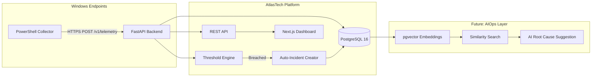
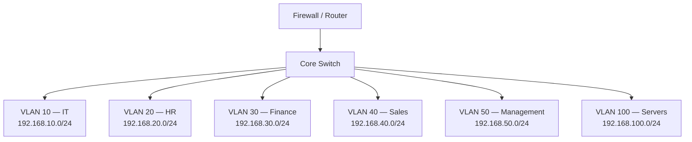

# AtlasTech — System Architecture Overview

## High-Level Architecture

## Network Topology

## Data Flow

1. **Telemetry Collection**: PowerShell agent on each endpoint gathers system vitals every 30 seconds.
2. **Ingestion**: Agent POSTs JSON payload to `POST /api/v1/telemetry/`.
3. **Storage**: Backend writes telemetry record linked to device in PostgreSQL.
4. **Threshold Engine**: Background worker checks for threshold breaches (disk > 90%, DNS failure, service down).
5. **Auto-Incident**: Breached thresholds auto-create incidents in the incidents table.
6. **Dashboard**: Next.js polls or subscribes to incidents and telemetry for real-time display.
7. **Future — AI**: Resolved incidents are embedded and stored for similarity search against new incidents.

## Tech Stack

| Layer | Technology |
|-------|-----------|
| Frontend | Next.js 15, TypeScript, Tailwind CSS v4, shadcn/ui |
| Backend | FastAPI, Python 3.11, SQLAlchemy 2.0, Pydantic v2 |
| Database | PostgreSQL 16, Redis 7 |
| Agent | PowerShell 5.1 / PowerShell Core |
| Infra | Docker Compose, Vagrant (lab VMs) |
| CI/CD | GitHub Actions |
| Future AI | pgvector, sentence-transformers, scikit-learn |
