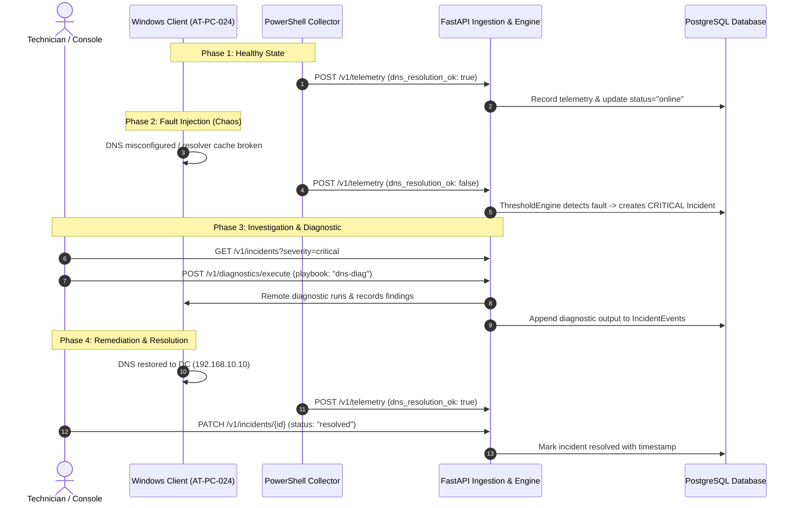

# AtlasTech End-to-End Operational Failure Scenario

This runbook documents and proves the core operational loop:

$$\text{Infrastructure Fault} \longrightarrow \text{Telemetry Agent} \longrightarrow \text{Automated Ingestion} \longrightarrow \text{Threshold Alert} \longrightarrow \text{Console Triage} \longrightarrow \text{Remote Diagnostic} \longrightarrow \text{Remediation} \longrightarrow \text{Resolution}$$

---

## 🔁 The Complete 7-Step Life of an Incident



---

## 🛠️ Step-by-Step Execution Guide

### Step 1: Baseline Telemetry
On client workstation `AT-PC-024`:
```powershell
.\agents\collector\collector.ps1 -ApiUrl "http://192.168.10.1:8000/api/v1/telemetry"
```
*Expected: Device `AT-PC-024` shows green status lights on Operations Console (`http://localhost:3000`).*

---

### Step 2: Inject Chaos Fault (DNS Outage)
On client workstation `AT-PC-024`:
```powershell
.\infra\chaos\inject-dns-fault.ps1
```
*Expected:*
1. PowerShell agent detects `dns_resolution_ok = $false`.
2. Transmits payload to API.
3. API ThresholdEngine generates ticket: **`[DNS] Resolution Failure on AT-PC-024`** with `CRITICAL` severity.
4. Open the **Incident Desk** on `http://localhost:3000` to inspect the newly opened incident.

---

### Step 3: Run Remote Diagnostic Playbook
From the web console (or API):
1. Click **"Run Diag"** on `AT-PC-024`.
2. Select **"DNS & Name Resolution Diagnostic"**.
3. View the terminal output identifying failed domain controller lookup.

---

### Step 4: Remediate & Resolve
On client workstation `AT-PC-024`:
```powershell
.\infra\chaos\reset-chaos.ps1
```
1. DNS client cache is cleared and adapter DNS is reset to `192.168.10.10`.
2. Collector agent sends healthy heartbeat.
3. On the web dashboard, click **"Resolve Ticket"**.
